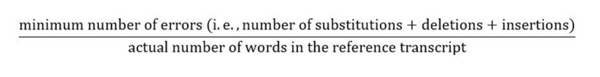
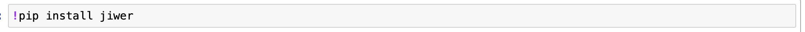
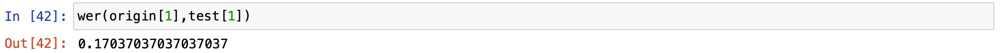
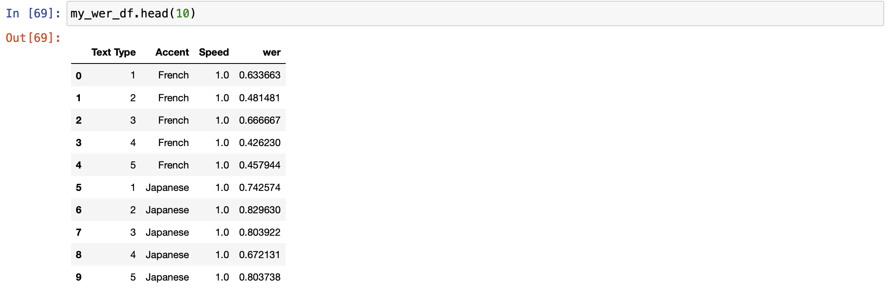

# Topic: Researching the Impact of Multiple Factors in Speech Transcription Using Amazon Transcribe Service

## Data Preparation
[UploadAudio](https://github.com/Sirui1303/QTM350FinalProject/blob/7af3d8c7f3d668af8e00e3068ff9654a29d7698b/notebook/UploadtoS3.ipynb)

## Transcribe Model Running
[RunTranscribe](https://github.com/Sirui1303/QTM350FinalProject/blob/7af3d8c7f3d668af8e00e3068ff9654a29d7698b/notebook/Run%20Transcribe%20Code.ipynb)
## Word Error Rate Calculation
In order to evaluate the accuracy of transcribed text generated by Amazon Transcribe, we introduce a metric called Word Error Rate (WER). This method is recommended by the US National Institute of Standards and Technology for the evaluation of ASR systems.
WER is defined as the normalized Levenshtein edit distance. Levenshtein edit distance calculates the distance between the reference and the hypothesis.:

The formula is

WER is the percentage of transcription errors produced by the ASR method compared to the number of words actually spoken. In other words, it’s the minimum number of words that need to be corrected to change the hypothesis transcript into the reference transcript, divided by the number of words that the speaker originally said. 
According to this formula, we know that the lower the WER, the more accurate the transcribed text is, with 0 error rate the best. WER can go beyond 1 if there are too many insertion errors.

The usage of WER is simple. This algorithm is contained in the jiwer package. First we should install it using the pip function.

Then we import the wer function from the jiwer package

After we prepared the reference text and hypothesis text we wanted to test on, we can call the wer() function to get the result (origin refers to reference text, test refer to hypothesis text),

Calculating WER for all the transcribed text files we collected, we make our WER table and can move on to the statistical analysis part.
Below is a glimpse of the WER dataframe.

## Data Visualization And Analysis
[DataVisualization](https://github.com/Sirui1303/QTM350FinalProject/blob/5c8ddca490d27c8c614815aa9d5d408f365180b4/notebook/Data%20Analysis%20Code.ipynb)
